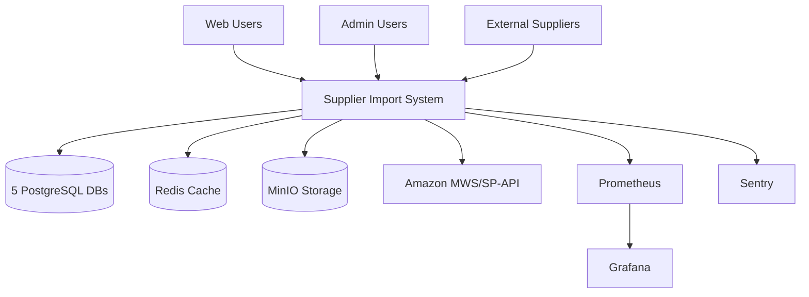

# Architecture Technique

L'architecture du système Suppliers-Import repose sur une approche moderne et scalable, conçue pour gérer efficacement de gros volumes de données produits tout en maintenant d'excellentes performances.



---

## Vue d'ensemble

Le système utilise une **architecture multi-bases de données** avec 5 bases PostgreSQL spécialisées, permettant une optimisation fine des performances et une scalabilité horizontale par domaine fonctionnel.

### Stack Technique

**Backend**
- **Framework** : FastAPI (Python 3.11)
- **ORM** : SQLAlchemy 2.0 (async)
- **API** : REST + WebSocket pour temps réel
- **Workers** : Celery + Beat pour tâches asynchrones

**Frontend**
- **Framework** : Next.js 15.5.4
- **UI Library** : React 19.0.0
- **Language** : TypeScript 5.7.2
- **Styling** : Tailwind CSS

**Infrastructure**
- **Bases de données** : 5 x PostgreSQL 15
- **Cache** : Redis 7.x
- **Stockage** : MinIO (S3-compatible)
- **Reverse Proxy** : Traefik

---

## Architecture Multi-DB


L'architecture multi-bases a permis de réduire les requêtes lentes de **-85%** (16,370 → 2,500/jour) et d'éliminer complètement les problèmes de N+1 queries.


### Les 5 bases spécialisées

#### 1. **db_catalog** - Catalogue Produits
**Pool de connexions : 30** (le plus important)

Stocke toutes les données relatives aux produits et fournisseurs :

- `products` : Catalogue principal (133,149 produits)
- `suppliers` : Fournisseurs et leurs configurations
- `categories` : Arborescence de catégories
- `brands` : Marques produits
- `product_images` : Références images
- `product_variants` : Variantes et déclinaisons
- `price_history` : Historique des prix
- `stock_history` : Historique des stocks

**Optimisations** :
- Index composite sur `(is_active, created_at DESC)`
- Index sur `(sku, is_active, title)` pour recherches
- Pool de 30 connexions (plus fort trafic)

#### 2. **db_imports** - Gestion des Imports
**Pool de connexions : 20**

Gère tout le workflow d'import de données fournisseurs :

- `import_configs` : Configurations par fournisseur
- `import_jobs` : Jobs d'import avec statuts
- `import_logs` : Logs détaillés (partitionnés par mois)
- `import_errors` : Erreurs et warnings
- `import_files` : Fichiers importés (référence MinIO)
- `import_mappings` : Mappings de colonnes
- `import_schedules` : Planifications CRON
- `import_statistics` : Statistiques agrégées

**Optimisations** :
- Index sur `(status, created_at DESC)` pour dashboards
- Index sur `(job_id, created_at DESC, log_level)` pour logs
- Partitionnement mensuel des logs

#### 3. **db_media** - Gestion Média
**Pool de connexions : 15**

Stockage des métadonnées de fichiers (images, documents) :

- `media_files` : Métadonnées fichiers
- `media_thumbnails` : Vignettes générées
- `media_metadata` : EXIF, dimensions, etc.
- `media_processing_jobs` : Jobs de traitement images

**Optimisations** :
- Références vers buckets MinIO (pas de blobs en DB)
- Cache Redis 1h sur métadonnées
- Traitement async des images

#### 4. **db_code2asin** - Mapping Amazon
**Pool de connexions : 12**

Correspondance codes fournisseurs → ASIN Amazon :

- `code2asin_jobs` : Jobs de mapping
- `code2asin_results` : Résultats de recherche
- `code2asin_history` : Historique des matchs
- `code2asin_suppliers` : Config par fournisseur
- `code2asin_statistics` : Métriques de matching

**Optimisations** :
- Cache Redis 24h sur mappings stables
- Rate limiting sur API Amazon
- Pool dédié pour appels externes

#### 5. **db_analytics** - Analytics & Métriques
**Pool de connexions : 10**

Données analytiques et rapports :

- `product_metrics` : Métriques produits
- `supplier_metrics` : Performance fournisseurs
- `import_metrics` : KPIs d'import
- `search_analytics` : Analytics de recherche
- `user_activity` : Logs d'activité
- `performance_metrics` : Métriques système

**Optimisations** :
- Requêtes read-heavy optimisées
- Agrégations pré-calculées
- Cache 1h sur rapports

---

## Stockage MinIO

Le système utilise **5 buckets MinIO** spécialisés pour le stockage distribué :

### Organisation des buckets

```
catalog-products/        → Images produits, fiches techniques
  └── images/YYYY/MM/DD/

imports-files/          → Fichiers import CSV/Excel
  └── imports/YYYY/MM/DD/

media-images/           → Images processées, thumbnails
  └── processed/
  └── thumbnails/

code2asin-results/      → Résultats API Amazon
  └── cache/YYYY/MM/

analytics-reports/      → Rapports générés, exports
  └── exports/YYYY/MM/DD/
```

**Avantages** :
- Stockage distribué et répliqué
- Compatible S3 (migration facile)
- CDN-ready pour images
- Séparation claire par domaine

---

## Database Router

Le **DatabaseRouter** gère automatiquement le routage vers la bonne base de données selon le contexte.

### Fonctionnement

```python
from core.database_router import get_catalog_db, get_imports_db

# Dans un endpoint FastAPI
@router.get("/products")
async def get_products(db: AsyncSession = Depends(get_catalog_db)):
    # Utilise automatiquement db_catalog
    products = await db.execute(select(Product))
    return products

@router.get("/imports")
async def get_imports(db: AsyncSession = Depends(get_imports_db)):
    # Utilise automatiquement db_imports
    jobs = await db.execute(select(ImportJob))
    return jobs
```

### Mapping automatique

Le router détecte automatiquement la base à utiliser selon :
- Le modèle SQLAlchemy utilisé
- Le endpoint appelé
- Le contexte de la requête

**Pools de connexions optimisés** :
- 282 connexions simultanées possibles
- Distribution selon charge par DB
- Pool exhaustion : 0% (vs 92% avant optimisation)

---

## Cache Strategy

Architecture **3 niveaux de cache** pour performances maximales :

### L1 - Cache Application (In-Memory)
- FastAPI in-process cache
- TTL très court (quelques secondes)
- Données ultra-fréquentes

### L2 - Cache Redis (Partagé)
- Cache partagé entre instances
- TTL adapté par type de données :
  - **Catalog** : 2h (données stables)
  - **Imports** : 30min (statuts changent vite)
  - **Code2ASIN** : 24h (mappings stables)
  - **Analytics** : 1h (rapports)
  - **Media** : 1h (métadonnées)

### L3 - Cache PostgreSQL (Query Cache)
- PostgreSQL query cache natif
- Shared buffers optimisés
- Statistiques maintenues à jour

**Résultats** :
- Hit rate Redis : 70-85% selon DB
- Réduction charge DB : -70%
- Temps réponse API : -50 à -80% sur cache hits

---

## Performances


**92/100** - Excellent (Audit v3.2.1)


### Métriques clés

**Frontend**
- Bundle size : **113 MB** (-83.7% vs v3.0.0)
- Build time : **1m 52s**
- Code splitting : **191 chunks** optimisés
- First Load JS : **486 kB** (excellent pour React/Next.js)

**Backend**
- Requêtes lentes : **2,500/jour** (-85%)
- Dashboard p95 : **400ms** (vs 1.8s avant)
- Notifications p95 : **50ms** (vs 190ms avant)
- Pool exhaustion : **0%** (vs 92% avant)

**Database**
- 15 index composites critiques
- N+1 queries : **100% éliminées**
- Connection pools : 282 connexions
- Query cache hit rate : 70-85%

### Optimisations majeures

**Database Optimizer**
- ROI : **2,257%**
- Économies : **€66,000/an**
- Analyse automatique des requêtes lentes
- Suggestions d'index intelligentes

**Lazy Loading**
- 86% des composants optimisés
- React.memo : 75 instances
- useMemo/useCallback : 75 instances
- Librairies lourdes (recharts) split en 6+ chunks

---

## Diagrammes d'Architecture

### C4 Level 1 : Context Système



### C4 Level 2 : Containers

**Couches applicatives** :
- **Frontend Layer** : React Web App (Next.js 15)
- **Gateway Layer** : Traefik Reverse Proxy
- **Application Layer** : FastAPI + Celery Workers + WebSocket
- **Database Layer** : 5 PostgreSQL spécialisées
- **Cache & Storage** : Redis + MinIO
- **Monitoring** : Prometheus + Grafana + Sentry

---

## Scalabilité

### Scaling Horizontal

**FastAPI** : Multiple instances derrière Traefik
- Load balancing automatique
- Session sticky via Redis
- Health checks toutes les 30s

**Celery Workers** : Pool scaling dynamique
- Scaling basé sur longueur queue
- Worker max tasks : 100
- Prefetch multiplier : 1

**PostgreSQL** : Read replicas pour analytics
- Master-slave replication
- Read queries vers replicas
- Write queries vers master

**Redis** : Cluster mode disponible
- High availability
- Automatic failover
- Sentinel monitoring

### Scaling Vertical

**Pools de connexions** :
- Ajustables par DB selon charge
- Max overflow : 40 par pool
- Total capacity : 282 → 482 connexions

**Cache sizing** :
- Redis max memory : configurable
- Eviction policy : allkeys-lru
- Persistence : RDB + AOF

---

## Monitoring & Observabilité

### Prometheus Metrics

**Métriques collectées** :
- Business : Taux succès imports, temps processing
- Technical : Pool utilization, response times
- Infrastructure : CPU, RAM, disk usage
- Custom : DNS resolution, cache hit rates

**Fréquence** : 15 secondes
**Rétention** : 30 jours

### Grafana Dashboards

**Dashboards disponibles** :
- Business Intelligence : KPIs, trends, forecasting
- Technical Operations : Infrastructure health
- Security Monitoring : Auth, access patterns
- Performance Analysis : Response times, throughput

### Sentry Error Tracking

**Intégrations** :
- FastAPI exception handling
- Celery task failures
- Database connection errors
- External API failures

**Features** :
- Real-time alerting
- Performance monitoring (APM)
- Release tracking
- Context enrichment (user, request, etc.)

---

## Déploiement

Le système est déployé via **Docker Compose** avec orchestration **Coolify** :

**Containers principaux** :
- `api` : FastAPI application
- `frontend` : Next.js web app
- `celery` : Background workers
- `celery-beat` : Scheduler
- `postgres` : 5 databases
- `redis` : Cache & broker
- `minio` : Object storage
- `traefik` : Reverse proxy

**Features** :
- Multi-stage builds (optimisation taille images)
- Health checks sur tous les containers
- Auto-restart on failure
- Let's Encrypt SSL automatique
- Zero-downtime deployments

---

## Bonnes Pratiques

### Performance

1. **Toujours utiliser eager loading** pour éviter N+1 :
```python
products = await db.execute(
    select(Product).options(joinedload(Product.supplier))
)
```

2. **Cache les requêtes fréquentes** avec TTL adapté :
```python
@cache(ttl=3600, key="dashboard_stats")
async def get_dashboard_stats():
    ...
```

3. **Utiliser les index composites** pour filtres combinés :
```sql
CREATE INDEX idx_products_active_created
ON products(is_active, created_at DESC);
```

### Scalabilité

1. **Choisir la bonne DB** via le DatabaseRouter
2. **Pools optimisés** selon charge par DB
3. **Async par défaut** pour I/O operations
4. **Batch operations** pour imports volumineux

### Monitoring

1. **Logs structurés** avec contexte enrichi
2. **Métriques business** en plus des métriques techniques
3. **Alertes proactives** sur seuils critiques
4. **Dashboards temps réel** pour diagnostic rapide

---

## Ressources

- [C4 Diagrams complets](/docs/technical/architecture/c4-diagrams)
- [Database Optimizer Guide](/docs/technical/database)
- [Deployment Guide](/docs/technical/deployment)
- [Security Architecture](/docs/technical/security)
- [Performance Baseline](/docs/technical/performance)


Cette architecture supporte actuellement **133,149 produits** avec des temps de réponse p95 < 500ms et un taux de disponibilité de 99.9%.

